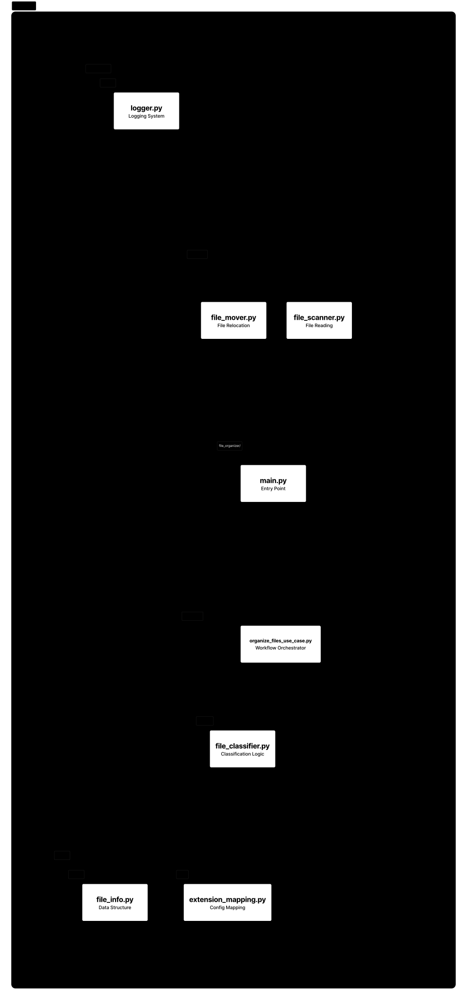

# File Organizer

A console-based Python application that automatically organizes files into categorized directories based on their extensions.

The project demonstrates a layered architecture, filesystem manipulation, dependency injection, structured logging, automated testing, and containerized execution with Docker.


---

## Features

- Organizes files into category-specific directories
- Supports images, documents, videos, archives, audio, development files, and more
- Creates destination folders automatically
- Prevents filename collisions by generating unique names
- Handles invalid directories and unexpected errors gracefully
- Provides centralized JSON logging
- Includes unit and integration tests
- Supports Windows, macOS, and Linux
- Can be executed locally or inside a Docker container

---

## Architecture

The application follows a layered architecture that separates business logic, domain rules, and infrastructure concerns.

### Architecture Diagram

<p align="center">
    
</p>

### Project Structure

```text
file_organizer/
│
├── application/
│   ├── organize_files_use_case.py
│   └── services/
│       └── file_classifier.py
│
├── domain/
│   ├── entities/
│   │   └── file_info.py
│   └── rules/
│       └── extension_mapping.py
│
├── infrastructure/
│   ├── file_system/
│   │   ├── file_scanner.py
│   │   └── file_mover.py
│   │
│   └── logging/
│       └── logging_configuration.py
│
├── tests/
│
├── Dockerfile
├── pyproject.toml
├── uv.lock
└── main.py
```

### Layer Responsibilities

| Layer | Responsibility |
|--------|----------------|
| **Domain** | Business entities and file categorization rules |
| **Application** | Coordinates the file organization workflow |
| **Infrastructure** | Filesystem access and logging |
| **Entry Point** | Initializes dependencies and starts the application |

---

## Supported Categories

| Category | Extensions |
|----------|------------|
| Images | jpg, jpeg, png, gif, bmp, svg, webp, tiff, ico, heic |
| Documents | pdf, doc, docx, txt, md, csv, xls, xlsx, ppt, pptx, odt, ods |
| Audio | mp3, wav, flac, m4a, aac, ogg, wma |
| Video | mp4, mkv, avi, mov, wmv, flv, webm, mpeg |
| Archives | zip, rar, 7z, tar, gz |
| Applications | exe, msi, dmg, pkg, deb, rpm, apk |
| Development | py, js, ts, html, css, json, xml, yaml, yml, sh, bat, c, cpp, java, go |
| Books | epub, mobi, fb2, djvu |
| Design | psd, ai, fig, blend, dwg, stl |

---

## Installation

Clone the repository:

```bash
git clone https://github.com/rmnp1/file-organizer.git

cd file-organizer
```

Install dependencies:

```bash
uv sync
```

---

## Usage

Run the application locally:

```bash
uv run main.py
```

When prompted, enter the directory to organize.

Example:

```text
~/Desktop/Downloads
```

---

## Running with Docker

Build the Docker image from the project root:

```bash
docker build -t file-organizer .
```

Navigate to the directory you want to organize and run the container.

**macOS / Linux**

```bash
docker run -it --rm -v "$(pwd):/data" file-organizer
```

**Windows (PowerShell)**

```powershell
docker run -it --rm -v "${PWD}:/data" file-organizer
```

The current directory is mounted into the container as `/data` and is automatically used as the target directory for file organization.


---

## Testing

Run the complete test suite:

```bash
uv run pytest
```

---

## Logging

The application uses centralized structured JSON logging.

Example output:

```json
{
  "time": "2026-06-22 20:41:23",
  "level": "INFO",
  "msg": "File 'photo.jpg' moved to 'Images/photo.jpg'"
}
```

---

## Tech Stack

- Python 3.14
- uv
- Docker
- os
- pathlib
- shutil
- logging
- python-json-logger
- pytest
- dataclasses

---

## License

Created for educational and portfolio purposes.
